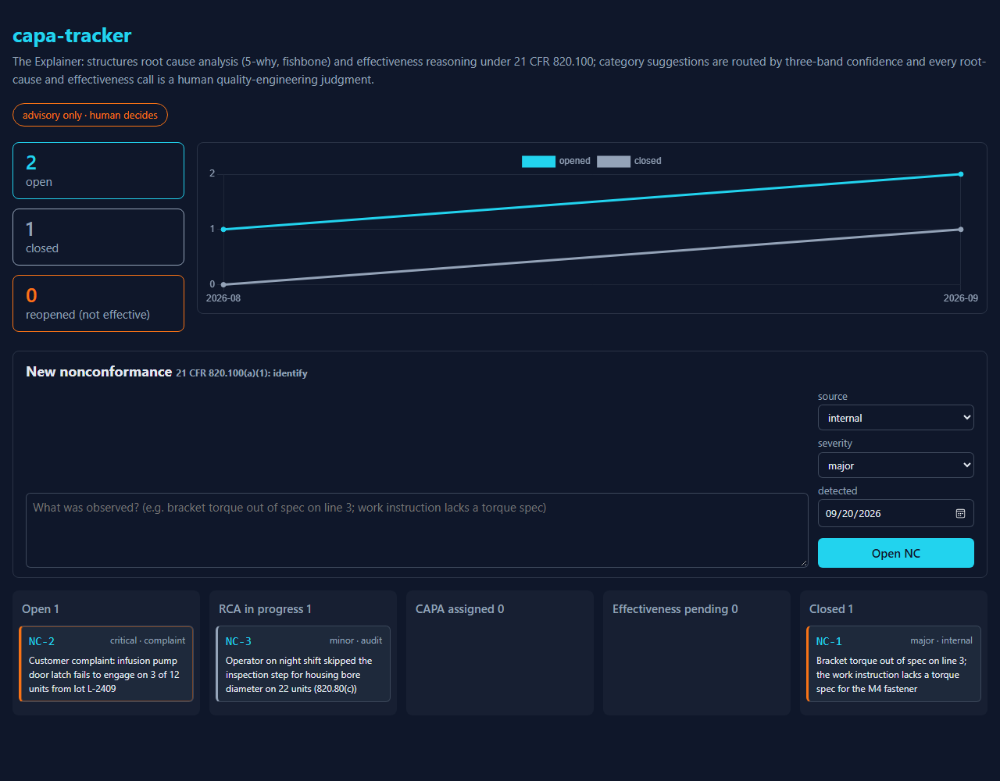
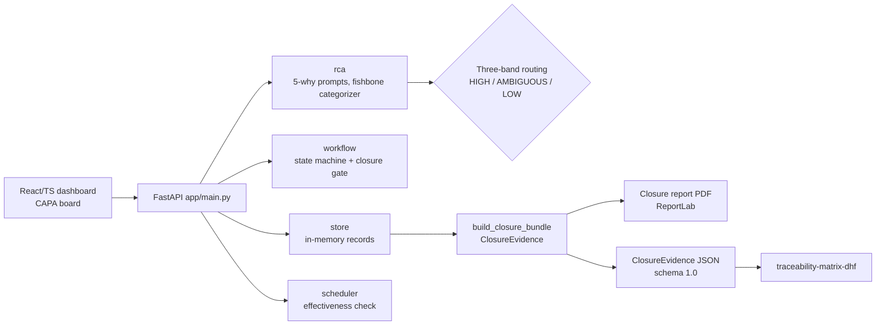

# capa-tracker

[](https://github.com/LSaiko/capa-tracker/actions/workflows/ci.yml)
[](https://github.com/LSaiko/capa-tracker/actions/workflows/pages.yml)
[](pyproject.toml)
[](https://docs.pydantic.dev/latest/)
[](.github/workflows/ci.yml)
[](https://www.ecfr.gov/current/title-21/chapter-I/subchapter-H/part-820/subpart-J/section-820.100)
[](LICENSE)
[](https://lsaiko.github.io/capa-tracker/)

**CAPA workflow for FDA-regulated devices: a nonconformance cannot be closed until its
corrective action has been verified to work, and every step is recorded the way
21 CFR 820.100 asks for it.**

When a medical device manufacturer finds a defect, a complaint or an audit finding, the FDA
Quality System Regulation does not just require a fix. 21 CFR 820.100(a) requires a
documented Corrective and Preventive Action (CAPA) procedure that (1) analyses quality data
to identify the problem, (2) investigates its cause, (3) identifies the action needed to
correct it and prevent recurrence, (4) verifies or validates that the action was effective
and did not break anything else, (5) implements and records the change, (6) tells the people
responsible for quality, and (7) brings it to management review; and 820.100(b) requires all
of it to be documented. This tool is that workflow as a state machine: intake, root cause
analysis, corrective action, a scheduled effectiveness check the record cannot skip, and
closure into one evidence bundle rendered as both a PDF report and a JSON export. An
"Explainer" assistant helps the quality engineer structure the root cause analysis (5-why
chain, fishbone categories) with an explicit confidence band on every suggestion, but it
never decides the root cause or the effectiveness result: those stay human
quality-engineering judgments.

[](https://lsaiko.github.io/capa-tracker/)

_Click the screenshot to open the live demo (seeded with synthetic data, no backend required;
the demo workflow runs in the browser so you can move a nonconformance through every state)._

## Contents

- [The CAPA lifecycle](#the-capa-lifecycle)
- [Architecture](#architecture)
- [Confidence-banded category suggestion](#confidence-banded-category-suggestion)
- [The 5-why heuristic](#the-5-why-heuristic)
- [Interview talking points](#interview-talking-points)
- [Quick start](#quick-start)
- [API](#api)
- [Layout and dev commands](#layout-and-dev-commands)
- [Related projects](#related-projects)
- [Interview Q&A](#interview-qa)
- [License](#license)

## The CAPA lifecycle

Five states, one loop. Each state is where the record satisfies a sub-clause of
21 CFR 820.100(a); the only way out of `Effectiveness check pending` is a recorded result,
and only an `effective` result opens the door to `Closed`.

```mermaid
stateDiagram-v2
    direction LR
    [*] --> Open
    Open --> RCA_in_progress: POST /rca
    RCA_in_progress --> CAPA_assigned: POST /capa
    CAPA_assigned --> Effectiveness_check_pending: check scheduled
    Effectiveness_check_pending --> Closed: result effective, POST /close
    Effectiveness_check_pending --> CAPA_assigned: result not_effective (reopen)
    Closed --> [*]

    Open: Open — 820.100(a)(1) identify from quality data
    RCA_in_progress: RCA in progress — 820.100(a)(2) investigate the cause
    CAPA_assigned: CAPA assigned — 820.100(a)(3) action to correct and prevent recurrence
    Effectiveness_check_pending: Effectiveness check pending — 820.100(a)(4) verify or validate
    Closed: Closed — 820.100(a)(5)-(7), 820.100(b) record, disseminate, management review
```



Every other transition is rejected with HTTP 409 (`Open -> Closed`, `RCA in progress ->
Closed`, and so on: all 20 invalid pairs are tested individually). A `not_effective` result
sends the record back to `CAPA assigned`, a revised action replaces the one that did not
work, a new check is scheduled, and the reopen is counted on the metrics tile.

## Architecture



The PDF and the JSON are rendered from the same `ClosureEvidence` object
(`app/export.py`), so the human-readable and machine-readable records cannot disagree. The
JSON contract is documented in [docs/closure-evidence-schema.md](docs/closure-evidence-schema.md)
and generated into [docs/closure-evidence.schema.json](docs/closure-evidence.schema.json);
a test fails if the file and the model drift apart.

## Confidence-banded category suggestion

When a nonconformance is described, the Explainer scores the six Ishikawa (fishbone)
categories, Method / Machine / Material / Manpower / Measurement / Environment, and routes
the result through three bands:

| Band | Confidence | What the tool does |
|---|---|---|
| HIGH | >= 0.80 | Auto-suggests the category (`suggested` is set) |
| AMBIGUOUS | 0.55 - 0.79 | Presents the top two candidates for the human to choose |
| LOW | < 0.55 | Asks a clarifying question instead of guessing |

The scorer (`app/rca.py`) is a keyword heuristic, not a classifier: each category has a
hand-picked vocabulary with weights 3 (strong, e.g. `torque spec`, `supplier`, `humidity`),
2 (typical, e.g. `procedure`, `calibration`) and 1 (weak, e.g. `operator`, `spec`), matched
as whole words on the lower-cased description. The confidence is

```
confidence = (top_score / sum_of_all_category_scores) * min(1, top_score / 3)
```

The first factor measures how dominant the top category is; the second keeps a single weak
hit from looking certain ("the operator noticed it" scores Manpower 1, confidence 0.33, LOW).
"Wrong torque spec" is Method 4 with nothing else, confidence 1.0, HIGH. "Gauge calibration
was overdue and the fixture was worn" is Measurement 5 vs Machine 3, confidence 0.625,
AMBIGUOUS, so both are offered. The ceiling and the upgrade path are named in the code
(`# ponytail:` comment): exact vocabulary, no synonyms or negation; the upgrade is embeddings
or an LLM classifier behind the same `CategorySuggestion` contract, so the API and the bands
do not change.

The role boundary is deliberate. The Explainer organises what the engineer says and tells
them how sure it is. It never fills `root_cause_text`, never sets an effectiveness result,
and in the LOW band it does not produce a category at all. The closure report prints the
suggestion with its band and the line "the suggestion is advisory only" next to the
human-entered root cause.

## The 5-why heuristic

The 5-why wizard chains each question off the previous answer ("Why did *the tool was not
calibrated on schedule* happen?") and flags each answer with whether it *reads* systemic: an
answer that names a missing system element (`no procedure`, `not trained`, `never`,
`lacks`, ...) is flagged as reading like a root cause; an answer that restates the failure
(`failed`, `was wrong`, `defective`) is flagged as a symptom with "ask why again". This is a
heuristic, not certainty: the flag suggests the chain may be deep enough, and the quality
engineer decides when to stop and what to write as the root cause. The marker lists, the
formula above and worked examples are in [docs/rca-heuristics.md](docs/rca-heuristics.md).

## Interview talking points

**Why effectiveness checks are the step most QMS implementations skip.** It is easy to close
a CAPA on "action taken" and hard to close it on "action worked", because the second needs a
date in the future, a method, and evidence collected after the fix went in. Many quality
systems record the action and move on, which is why FDA 483 observations so often cite
820.100(a)(4): the verification or validation of the corrective action is missing,
undocumented, or done before the action was implemented. This tool makes the check a
*state*, not a calendar reminder. When a CAPA is assigned, the scheduler creates a pending
`EffectivenessCheck` at due date plus the review interval (30 days by default,
`CAPA_EFFECTIVENESS_INTERVAL_DAYS`) and the nonconformance enters `Effectiveness check
pending`. The record cannot leave that state without a result, `Closed` is only reachable
from it, and the closure gate rejects anything but an `effective` result for the same CAPA.
The reopen edge is what makes this enforceable: a `not_effective` result does not fail the
record or get argued with, it sends the record back to `CAPA assigned` for a revised
action, which gets its own scheduled check. The loop closes only when the fix is shown to
work.

**The confidence-banding design for category suggestion.** A category suggestion is useful
when it is right and harmful when it is confidently wrong, because the category shapes
which causes the team looks for. A binary "best guess" hides the difference between "the
description says torque spec, this is Method" and "the description mentions a shift and a
gauge, could be people or measurement". Three bands let the tool pass through only the
unambiguous case, hand the two-way case to the engineer as a choice with both scores
visible, and, in the LOW band, ask instead of guess. Asking is the correct output when the
evidence is thin: a clarifying question costs the engineer ten seconds and a wrong category
can cost the investigation. The band is stored on the RCA record and printed on the closure
report, so an auditor can see how much the tool claimed at the time.

**Why the closure PDF and the JSON come from the same bundle.** A closure record has two
audiences: the reviewer who reads a PDF, and the design-history tooling that ingests JSON
to link the CAPA to the requirements it affects. If those are produced by separate code
paths they drift: a field gets added to one, a label changes in the other, and the auditor
holds two documents that disagree about the same closure. `build_closure_bundle` assembles
one `ClosureEvidence` object from the store; `render_closure_report` and `export_json` are
both pure functions of that object. There is one source of truth, and the JSON schema is
generated from the same Pydantic model and asserted in tests, so the machine-readable
contract cannot silently diverge from what the PDF says.

## Quick start

```bash
# backend (Python >= 3.12)
pip install -e .[dev]
uvicorn app.main:app --reload          # http://127.0.0.1:8000/docs

# dashboard (Node 22)
cd dashboard && npm ci && npm run dev  # seed mode unless the API answers /health

# checks (what CI runs)
ruff check . && mypy app schemas && pytest --cov=app --cov=schemas --cov-branch
cd dashboard && npx tsc --noEmit && npm run build
```

| Env var | Where | Purpose |
|---|---|---|
| `ALLOWED_ORIGINS` | backend | Comma-separated CORS origins (default `*`) |
| `CAPA_EFFECTIVENESS_INTERVAL_DAYS` | backend | Days after the CAPA due date to schedule the check (default 30) |
| `VITE_API_BASE` | dashboard | Backend URL (default `http://localhost:8000`); seed mode if unreachable |
| `VITE_BASE` | dashboard build | URL subpath, e.g. `/capa-tracker/` for Pages (non-root forces seed mode) |

## API

| Method | Path | Body / query | Returns |
|---|---|---|---|
| GET | `/health` | | `{"status": "ok"}` |
| POST | `/nonconformance` | description, source, severity, detected_date | `Nonconformance` as `NC-n`, status `open` |
| GET | `/nonconformances` | | all nonconformances |
| GET | `/nonconformance/{nc_id}` | | record + RCA + per-answer 5-why flags + CAPA + checks + closure |
| GET | `/rca/suggest` | `?description=` | `CategorySuggestion` (candidates, confidence, band, suggested, prompt) |
| POST | `/rca` | `RootCauseAnalysis` (5-why steps or fishbone entries) | stored RCA with band + the suggestion; NC -> `rca_in_progress` |
| POST | `/capa` | nonconformance_id, action_description, owner, due_date | `CorrectiveAction` as `CAPA-n` + scheduled pending check; NC -> `effectiveness_pending` |
| POST | `/effectiveness-check` | `EffectivenessCheck` (result effective / not_effective) | NC (reopened to `capa_assigned` on not_effective) + check |
| POST | `/close` | `ClosureRecord` (closed_by, linked_requirement_ids) | `ClosureEvidence`; 409 unless the check is `effective` |
| GET | `/closure/{capa_id}/evidence.json` | | `ClosureEvidence` JSON (schema 1.0) |
| GET | `/closure/{capa_id}/report.pdf` | | closure report PDF with the 820.100 basis |
| GET | `/open-capas` | | every non-closed CAPA with its pending check |
| GET | `/metrics` | | open / closed / by_status / opened_by_month / closed_by_month / reopened |

Unknown ids return 404; a transition the state machine forbids returns 409 with the
`from -> to` pair in the detail. The store is in-memory (`# ponytail:` note in `app/store.py`).

## Layout and dev commands

- `/app` FastAPI backend: `workflow.py` (state machine, closure gate), `rca.py` (5-why prompts,
  fishbone categorizer), `scheduler.py` (effectiveness check), `store.py`, `report.py`
  (ReportLab PDF), `export.py` (ClosureEvidence bundle + JSON schema generator)
- `/schemas` Pydantic v2 models (`extra="forbid"` everywhere)
- `/dashboard` React/TS (Vite, Chart.js) CAPA board; seed mode for GitHub Pages
- `/tests` pytest (schemas, RCA heuristics, scheduler, every valid and invalid state
  transition, API happy path, reopen, 404/409, PDF/JSON endpoints, metrics bucketing)
- `/docs` [RCA heuristics](docs/rca-heuristics.md),
  [ClosureEvidence schema](docs/closure-evidence-schema.md)
- `/.github/workflows` CI (ruff, mypy, pytest with coverage on 3.12/3.13; tsc + Vite build)
  and Pages deploy of `dashboard/dist`

```bash
python -m venv .venv && .venv/Scripts/pip install -e .[dev]
.venv/Scripts/python -m pytest --cov=app --cov=schemas --cov-branch --cov-report=term-missing
.venv/Scripts/ruff check . && .venv/Scripts/mypy app schemas
.venv/Scripts/python -m app.export        # regenerate docs/closure-evidence.schema.json
uvicorn app.main:app --reload
cd dashboard && npm ci && npx tsc --noEmit && npm run build
```

## Related projects

- [traceability-matrix-dhf](https://github.com/LSaiko/traceability-matrix-dhf)
  ([live demo](https://lsaiko.github.io/traceability-matrix-dhf/)): the Archivist. Keeps the
  design-history traceability matrix and consumes this tool's `ClosureEvidence` feed through a
  planned `from_capa_closure` adapter (not yet built on either side), binding on `evidence_id`
  + `requirement_ids` so a closed CAPA becomes design-control evidence against the requirements
  it affected (820.30 <- 820.100).
- [ml-samd-validator](https://github.com/LSaiko/ml-samd-validator)
  ([live demo](https://lsaiko.github.io/ml-samd-validator/)): the Inspector, sibling role to
  this tool's Explainer. Produces drift / PCCP / fairness `ValidationEvidence` with the same
  three-band confidence routing and the same four binding keys.
- **Part 11 module (planned, not built).** 21 CFR Part 11 electronic signature on the closure
  record: signer identity, meaning of the signature, timestamp and a hash of the signed
  `ClosureEvidence`. The hook is `ClosureRecord.closed_by`, which today is a free-text name;
  the signature manifest would attach there and the bundle hash would cover the rest of the
  record. Nothing in this repository claims Part 11 compliance.
  Reference implementation of that hook: [part11-audit-trail](https://github.com/LSaiko/part11-audit-trail) (hash-chained audit log + Ed25519 signature over a record hash).

## Interview Q&A

**Why 5-why and fishbone rather than one?** They answer different questions. 5-why is
linear and goes for depth: one chain from the symptom to a systemic cause, which is the right
tool when there is one dominant failure path. Fishbone (Ishikawa) is broad: it forces the
team to consider all six categories before committing to a chain, which is the right tool
when the cause is not obvious or several factors interact. Most real investigations use a
fishbone to choose where to dig and a 5-why to dig there. The tool stores either as the
RCA method and renders either in the closure report; the category suggestion works for both
because it only reads the nonconformance description.

**Why does the state machine forbid `Closed` from anywhere but `Effectiveness check
pending`?** Because 820.100(a)(4) puts verification between the action and the closure, and
a state machine that allowed `Open -> Closed` or `CAPA assigned -> Closed` would let the
record satisfy 820.100(b) documentation without the step the regulation actually cares
about. Making the pending check the only predecessor of `Closed`, and making the closure
gate reject any result but `effective` for the same CAPA, turns "we verified it" from a
checkbox into a structural property: the record cannot be in `Closed` without an effective
check existing. The 20 forbidden pairs are each a test.

**Why a keyword heuristic instead of an LLM classifier for categories?** Four reasons, in
order. Deterministic: the same description gives the same band every time, which matters
when the band is printed on a regulated record. Auditable: the score is a sum of visible
weights over visible words; an inspector can recompute it. Testable: the thresholds and the
worked examples are unit tests, not prompts. And the description of a nonconformance often
contains product, lot and complaint-file details, so nothing leaves the QMS boundary. The
cost is recall: no synonyms, no negation, so "the gauge was fine but the fixture was worn"
still credits Measurement. That cost is bounded by the bands (it shows up as AMBIGUOUS, not
as a wrong HIGH). The upgrade path is named in `app/rca.py`: embeddings or an LLM classifier
behind the same `CategorySuggestion` contract, so the API, the bands and the tests do not
change.

**How would you handle a CAPA that needs more than one corrective action?** Today it is one
CAPA per nonconformance (`Store.capa_for`, marked `# ponytail:`), and the reopen path
replaces the ineffective action rather than appending to it. That is the deliberate
ceiling: it keeps the closure bundle a single `capa` + `effectiveness_check` pair and keeps
the state machine five states. The upgrade is a list of actions per nonconformance, each
with its own owner, due date and scheduled check, and a closure gate that requires *every*
action's check to be `effective`; the `ClosureEvidence` schema would go to 2.0 with `capas:
[]` and `effectiveness_checks: []`, and the hub adapter would need the same bump. Until a
real plan needs it, the ceiling is cheaper than the flexibility.

## License

MIT, see [LICENSE](LICENSE).
